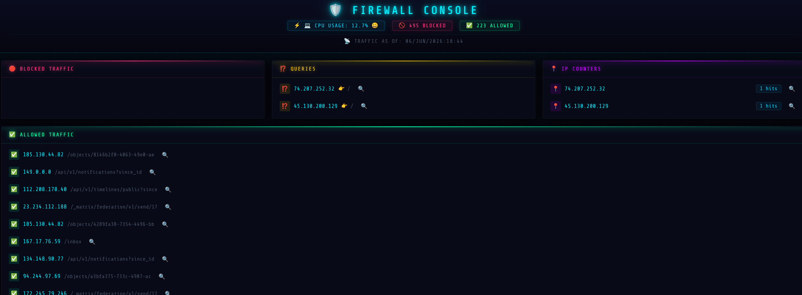

# Python Firewall — Real-Time DDoS Protection for Linux



**A lightweight, zero-dependency DDoS and bot protection system that hooks directly into NFTables to ban attackers in real time.** No bloated agents, no cloud subscriptions — just Python, nftables, and instant blocks.

---

## What It Does

- **Watches your NGINX logs** (file or journald) and bans IPs that exceed your rate threshold — within 30 seconds
- **Blocks entire countries** at the kernel level via NFTables sets (China, India, Indonesia, Israel, Singapore — all configurable)
- **Kills bots and scrapers automatically** — 170+ known crawlers, AI bots, and vulnerability scanners in the block list
- **Cyberpunk web dashboard** on port 6767 — live traffic view, blocked IPs, allowed traffic, hit counters
- **NTFY push alerts** — get a ping on your phone the moment an attack starts
- **CLI live mode** for direct server monitoring with `--print`
- **Runs as a systemd service** — set it and forget it

---

## Features at a Glance

| Feature | Details |
|---|---|
| Block engine | NFTables (kernel-level, near-zero overhead) |
| Detection window | Configurable (default: 30s) |
| Country blocking | 5 zones included (CN, IN, ID, IL, SG) + Cloudflare ranges |
| Bot signatures | 170+ user-agent patterns |
| Web UI | FastAPI + cyberpunk neon dashboard |
| Alerts | NTFY (self-hosted or ntfy.sh) |
| Log source | NGINX access log or systemd journald |
| Init system | systemd service file included |

---

## Requirements

- Python 3.10+
- `nftables` with a `blackhole` set (sample config below)
- NGINX (or any access log in combined format)
- Linux (tested on Gentoo, works on any systemd distro)

---

## Quick Start

```bash
# 1. Clone
git clone https://github.com/loblawbob873-svg/firewall.git
cd firewall

# 2. Install dependencies
python -m venv .venv
source .venv/bin/activate
pip install fastapi uvicorn httpx requests psutil

# 3. Configure
$EDITOR config.py

# 4. Run (web dashboard mode)
python firewall.py

# 5. Run (live CLI mode)
python firewall.py --print
```

Dashboard: **http://localhost:6767**

---

## Configuration (`config.py`)

```python
LOG_FILE = "/tmp/access.log"        # Path to NGINX access log
USE_JOURNALD = True                  # Read from systemd journal instead
JOURNALD_UNIT = "nginx"

IP_OCCURRENCE_THRESHOLD = 50        # Connections before auto-ban
TIME_FRAME = 30                      # Scan window in seconds

SUBNET_BLOCKS = []                   # CIDR ranges to always block

COUNTRY_BLOCKLIST = [                # Zone files to load into nftables
    "il-aggregated.zone",
    "in-aggregated.zone",
    "cn-aggregated.zone",
    "sg-aggregated.zone",
    "id-aggregated.zone",
]

NTFY_URL = "https://ntfy.sh/your-topic"   # Push notifications
```

### Allow List (`tier_one.py`)

Add IPs, user agents, or paths that should never be blocked. Remove an entry to have it rate-limited like everyone else.

### Block List (`ip_blocks.py`)

170+ bot signatures. Any request matching a string here gets banned immediately — no rate limit check needed. Easily extend with your own patterns.

---

## Running as a Systemd Service

```bash
sudo cp python-firewall.service /etc/systemd/system/
sudo systemctl daemon-reload
sudo systemctl enable --now python-firewall
```

---

## NFTables Setup

Save as `/etc/firewall.nft` and load with `nft -f /etc/firewall.nft`.  
The `blackhole` set is required — the app adds banned IPs and CIDRs here at runtime.

```nft
table ip filter {
    set http_ratelimit {
        type ipv4_addr
        size 65535
        flags dynamic,timeout
        timeout 1s
    }

    set blackhole {
        type ipv4_addr
        flags interval
    }

    set il { type ipv4_addr; flags interval; }
    set in { type ipv4_addr; flags interval; }
    set cn { type ipv4_addr; flags interval; }
    set sg { type ipv4_addr; flags interval; }
    set id { type ipv4_addr; flags interval; }

    chain input {
        type filter hook input priority filter; policy drop;

        ip saddr @blackhole drop
        ip saddr @il log prefix "Blocked-IL:" drop
        ip saddr @cn log prefix "Blocked-CN:" drop
        ip saddr @in log prefix "Blocked-IN:" drop
        ip saddr @sg log prefix "Blocked-SG:" drop
        ip saddr @id log prefix "Blocked-ID:" drop

        ct state new tcp dport 443 update @http_ratelimit { ip saddr limit rate 50/second burst 1 packets } accept
        ct state new tcp dport 80  update @http_ratelimit { ip saddr limit rate 25/second burst 1 packets } accept
        iif "lo" accept
        ct state established accept
        icmp type echo-request accept
        ip saddr 192.168.0.0/24 accept
    }

    chain forward { type filter hook forward priority filter; policy accept; accept; }
    chain output  { type filter hook output  priority filter; policy accept; accept; }
}

table ip nat {
    chain prerouting  { type nat hook prerouting  priority dstnat; policy accept; }
    chain postrouting { type nat hook postrouting priority srcnat; policy accept; masquerade; }
}

table ip6 filter {
    chain input   { type filter hook input   priority filter; policy drop; }
    chain forward { type filter hook forward priority filter; policy accept; }
    chain output  { type filter hook output  priority filter; policy accept; }
}
```

---

## License

GPL v3 — free to use, modify, and distribute. See [LICENSE](https://www.gnu.org/licenses/gpl-3.0.html).

Built by [@verita84@poster.place](https://poster.place/@verita84)
