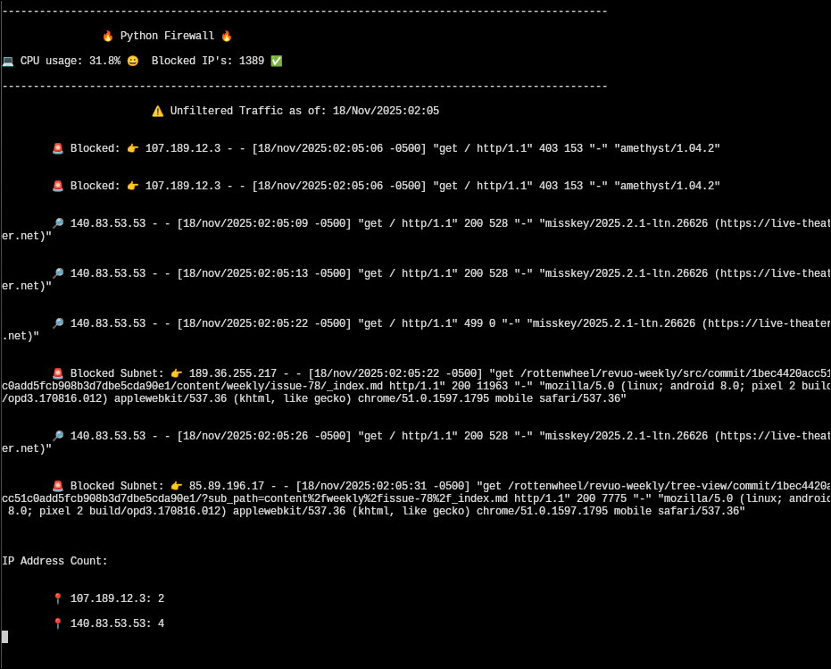

## DDOS Protection System



### Features
* Live Reporting 
* Automatic Blocking
* Customizable 
* Send Alerts to NTFY

### Requirements
* Python
* NFT Firewall

```
python -m venv venv
. venv/bin/activate
pip install requests logging psutil
```

### Run the app with Protection and Live Reporting
```
python firewall.py --print
```

### Sample NFT firewall

Save it as ```/etc/firewall.nft``` and load it with ```nft -f /etc/firewall.nft```
```
table ip filter {
	set http_ratelimit {
		type ipv4_addr
		size 65535
		flags dynamic,timeout
		timeout 1s
		elements = { }
	}

	chain input {
		type filter hook input priority filter; policy drop;
		udp sport 68 udp dport 67 ip saddr 0.0.0.0 ip daddr 255.255.255.255 accept
		ct state new tcp dport 443 update @http_ratelimit { ip saddr limit rate 50/second burst 1 packets } accept
		ct state new tcp dport 80 update @http_ratelimit { ip saddr limit rate 25/second burst 1 packets } accept
		iif "lo" accept
		ct state established accept
		icmp type echo-request accept
		ip saddr 192.168.0.0/24 accept
	}

	chain forward {
		type filter hook forward priority filter; policy accept;
		ct status dnat accept
		accept
	}

	chain output {
		type filter hook output priority filter; policy accept;
		accept
	}
}
table ip nat {
	chain prerouting {
		type nat hook prerouting priority dstnat; policy accept;
	}

	chain postrouting {
		type nat hook postrouting priority srcnat; policy accept;
		masquerade
	}
}
table ip6 filter {
	chain input {
		type filter hook input priority filter; policy drop;
	}

	chain forward {
		type filter hook forward priority filter; policy accept;
	}

	chain output {
		type filter hook output priority filter; policy accept;
	}
}
table ip6 nat {
	chain prerouting {
		type nat hook prerouting priority dstnat; policy accept;
	}

	chain postrouting {
		type nat hook postrouting priority srcnat; policy accept;
		masquerade
	}
}

```